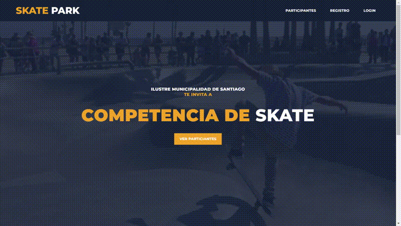
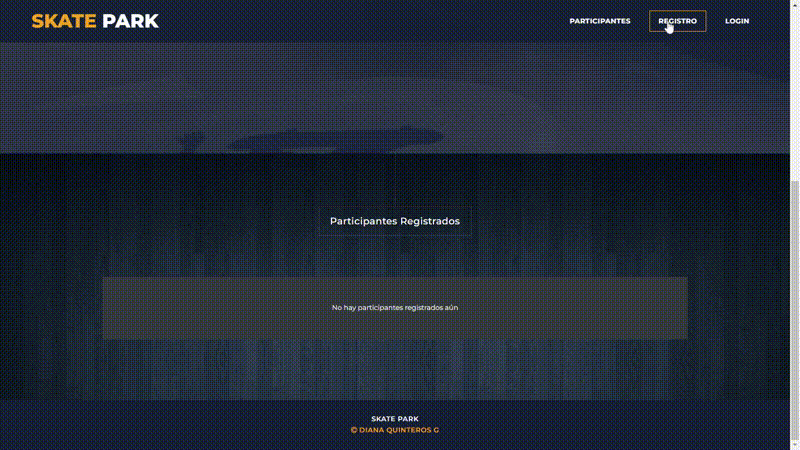
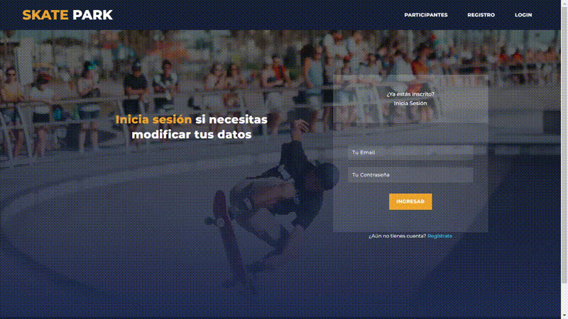

# Skatepark

La Municipalidad de Santiago, ha organizado una competencia de Skate para impulsar el
nivel deportivo de los jóvenes que desean representar a Chile en los X Games del próximo
año, y a través de esta plataforma web los participantes se podrán registrar y revisar 
el estado de su solicitud.

<b>Características</b> 
<ul>
  <li>Creación de API REST con el Framework Express</li>
  <li>Contenido dinámico con express-handlebars</li>
  <li>Funcionalidad Upload File con express-fileupload</li>
  <li>Seguridad y restricción de recursos o contenido con JWT</li>
</ul>

<b>Tecnologías Utilizadas:</b>

Node.js, Framework Express, Handlebars, JWT, Express-fileupload, PostgreSQL, HTML5, CSS3, Bootstrap v5, jQuery, SweetAlert2.

 
<figure>
  <figcaption><b>1. Página de Inicio</b></figcaption>
  
</figure>

<figure>
  <figcaption><b>2. Registro de Participante</b></figcaption>
  
</figure>

<figure>
  <figcaption><b>3. Actualización de Datos</b></figcaption>
  
</figure>

<figure>
  <figcaption><b>4. Módulo de Administrador</b></figcaption>
  
</figure>

